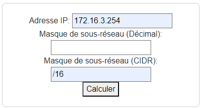

# Calculateur de sous réseaux

Un script en JS pour découvrir le calcul de sous réseaux et le HTML

***

# TP : Introduction à HTML, CSS et Bootstrap pour la création d'un formulaire réseau

## Objectif du TP

À la fin de ce TP, vous serez capables de créer un formulaire HTML pour saisir des informations réseau, utiliser CSS pour styliser le formulaire, et intégrer Bootstrap pour améliorer l'aspect visuel.


## Étape 1: Création du formulaire HTML de base

Vous devez créer un formulaire pour effectuer des calculs réseau.

* Création du fichier HTML

Dans un dossier nommé **TP-HTML-CSS-CalculSousReseau**, créez un fichier **index.html**.

Ouvrez ce fichier avec l'éditeur de votre choix. (VS Code conseillé).

* Structure de base

Voici la structure de base du fichier:

```html
<!DOCTYPE html>
<html lang="fr">
    <head>
        <meta charset="UTF-8">
        <meta name="viewport" content="width=device-width, initial-scale=1.0">
        
        <title>Calculateur réseau
            
    
    </body>
</html>
```

Vous devrez remplir les balises manquantes.
> Pensez aux balises fermantes, soignez l'indentation!
> Reprenez le memo HTML!

Appelez l'enseignant pour correction avant de passer à l'étape suivante.

***

## Étape 2 : Création du formulaire HTML

Les formulaires servent à collecter les informations saisies par l'utilisateur.
Maîtriser les formulaires est **indispensable** pour les **SIO**!

Voici les balises à utiliser:
* `<form></form>`
* `<input type="text" />`
* `<input type="submit" />`

> Lisez dans le memo HTML la syntaxe de ces balises

Ajouter un formulaire contenant:
* Une balise form
* 3 balises input de type text
* 1 balise input de type submit 

Votre formulaire, devra à terme, ressembler à ceci:


***

## Étape 3 : Stylisation avec CSS

Le CSS va permettre d'embellir, de donner une identité graphique, de rendre plus attractif les pages web.

Deux manières d'ajouter des styles.

- Directement dans le fichier HTML avec la balise `<style></style>`
- En **liant** la feuille de style dans un autre fichier: `<link rel="stylesheet" type="text/css" href="css/styles.css">`

> Prenez dès à présent l'habitude de ranger vos css ou js dans des dossiers spécifiques.

Vous devrez ajoutyer des styles suivants:
- marges
- couleurs de fond
- police
- transformation du texte

> Exemple de style css à appliquer
```css
body {
    font-family: Arial, sans-serif;
    margin: 20px;
}

form {
    max-width: 400px;
    margin: 0 auto;
    padding: 20px;
    border: 1px solid #ccc;
    border-radius: 8px;
}
```

***

## Étape 4 : Intégration de Bootstrap

Bootstrap est un outil pour les développeurs qui veulent un résultat professionnel sans passer trop de temps sur le graphisme.
Vous aurez rapidement des pages attrayantes au look certes impersonnel, mais vous apprendrez à personnaliser!


Ajouter les liens vers les fichiers CSS de Bootstrap dans votre fichier **index.html** au niveau de `<head>`.

```html
...
<head>
    <!-- ... autres balises ... -->
    <link rel="stylesheet" href="https://stackpath.bootstrapcdn.com/bootstrap/4.3.1/css/bootstrap.min.css">
</head>
...
```

Appliquez ensuite des classes **CSS** à vos éléments de formulaires pour en améliorer le style.

```html
<form id="subnetForm" class="mt-4 p-4 border rounded">
    <div class="form-group">
        <label for="ipAddress">Adresse IP:</label>
        <input type="text" class="form-control" id="ipAddress" required>
    </div>

    <div class="form-group">
        <label for="subnetMaskDecimal">Masque de sous-réseau (Décimal):</label>
        <input type="text" class="form-control" id="subnetMaskDecimal">
    </div>

    <div class="form-group">
        <label for="subnetMaskCIDR">Masque de sous-réseau (CIDR):</label>
        <input type="text" class="form-control" id="subnetMaskCIDR">
    </div>

    <button type="submit" class="btn btn-primary">Calculer</button>
</form>
```

***

## Étape 5 : Conclusion et Défi

Qu'avez vous appris?
Montrez nous vos créations!

Vous voyez à quel point les formulaires doivent être précis (pour fonctionner)
et attrayants pour les rendres agréables aux utilisateurs?

### Défi supplémentaire

Ajouter des fonctionnalités supplémentaires au formulaire, telles que la **validation des champs**, des **messages d'erreur personnalisés**, etc.

Ce TP offre une introduction progressive à la création de formulaires HTML, à la stylisation avec CSS, et à l'utilisation de Bootstrap pour améliorer le design. Les étudiants devraient être en mesure de comprendre comment créer des interfaces utilisateur interactives et attrayantes à la fin de ce TP.